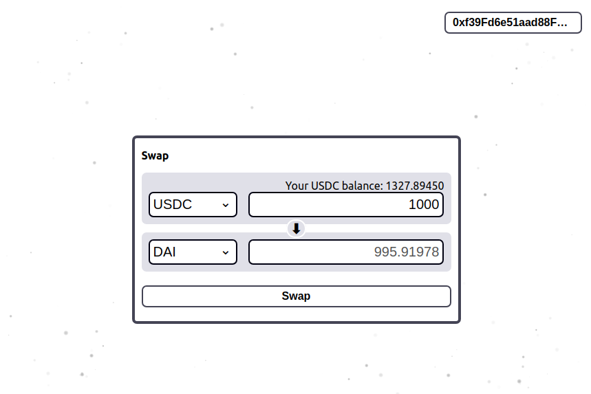

## Token Swap Using UniswapV2Router02

Token swap UI that interfaces with the [UniswapV2Router02 contract][uniswapv2router02].



Live [Cloudflare IPFS Gateway][cloudflare-ipfs-gateway] deployment: https://myopicmanoeuvre.cyou

It's implemented as a [create-react-app] application that uses...
- [web3-react] to obtain the injected web3 provider (typically MetaMask)
- [@apollo/client] for fetching token pair data from the UniswapV2 [subgraph][uniswapv2-subgraph]
- [SWR] for fetching blockchain data using React hooks

[Hardhat] is integrated into the project for running a forking node and testing the app's token swap API. The tests utilize [smock] for smart contract mocking. [TypeChain] and [@typechain/hardhat] are used to extract types from UniswapV2 artifacts.

There are limitations to the swaps it's able to execute:
- Only single-hop swaps (i.e. swaps for which a pair exists, and which therefore do not need to be routed through multiple pairs) are supported.
- Only exact input swaps (i.e. swaps where an exact input amount is specified, and an inexact output amount is received) are supported.

(But that's okay, since I'm only building this to learn a few things anyway.)

### Running it

Install dependencies:
```shell
yarn install
```

Edit `.env` in the project root:
```shell
REACT_APP_JSON_RPC_URL='https://eth-mainnet.alchemyapi.io/v2/<YOUR_ALCHEMY_API_KEY>'
REACT_APP_LOCAL_CHAIN_ID=12345
REACT_APP_FORKING_BLOCK_NUMBER=12759779
REACT_APP_INITIAL_BALANCE_ETHER=15
```
They are prefixed with `REACT_APP_` to make use of `create-react-app`'s convenience of loading variables so prefixed from `.env` in the project root into an object named `process.env` available in the browser. In order to make the same variables available when running in Node (for Hardhat), [`src/envVars.ts`][envVars.ts] loads them into Node's `process.env` using [dotenv].

- `REACT_APP_JSON_RPC_URL` ― JSON RPC URL of a mainnet *archive* node, e.g. from [Alchemy]
- `REACT_APP_LOCAL_CHAIN_ID` ― Chain ID of the local mainnet-forking Hardhat node
- `REACT_APP_FORKING_BLOCK_NUMBER` ― Block from which to fork
- `REACT_APP_INITIAL_BALANCE_ETHER` ― Initial ether balance allotted to each account by the Hardhat node

The chain ID needs to match the one you set on the network that has an *RPC URL* of `http://localhost:8545` in MetaMask. For safety reasons, the app will make itself unusable when the Web3 provider is connected with a chain that has a different ID.

As for **accounts**, either import one of the accounts that are displayed by Hardhat when starting the local node into MetaMask, or export the private key of an account that you are using for testing purposes from MetaMask and add it to the `hardhat` network in `hardhat.config.ts`:
```typescript
const config: HardhatUserConfig = {
  // ...
  networks: {
    hardhat: {
      // ...
      accounts: [
        {
          privateKey: '<YOUR_EXPORTED_PRIVATE_KEY>',
          balance: initialBalanceEther,
        },
      ],
      // ...
  },
  // ...
}
```

Start the forking node:
```shell
npx hardhat node
```

Start the app:
```shell
yarn start
```

### Tests

There are a few tests that may be run using Hardhat to verify the functionality of the app's [token swap API][tokenSwapAPI]:
```shell
npx hardhat test tests/tokenSwapApi.ts
```

[uniswapv2router02]: https://uniswap.org/docs/v2/smart-contracts/router02/
[cloudflare-ipfs-gateway]: https://developers.cloudflare.com/distributed-web/ipfs-gateway
[create-react-app]: https://github.com/facebook/create-react-app
[web3-react]: https://github.com/NoahZinsmeister/web3-react
[@apollo/client]: https://www.apollographql.com/docs/react/
[uniswapv2-subgraph]: https://thegraph.com/legacy-explorer/subgraph/uniswap/uniswap-v2
[swr]: https://swr.vercel.app/
[hardhat]: https://hardhat.org/
[smock]: https://github.com/ethereum-optimism/optimism/tree/develop/packages/smock
[typechain]: https://github.com/ethereum-ts/TypeChain
[@typechain/hardhat]: https://github.com/ethereum-ts/TypeChain/tree/master/packages/hardhat
[envVars.ts]: src/envVars.ts
[dotenv]: https://github.com/motdotla/dotenv#readme
[alchemy]: https://www.alchemy.com/supernode
[tokenSwapAPI]: src/features/tokenSwap/api.ts
